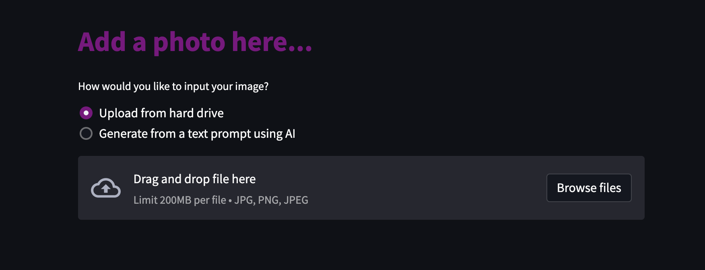
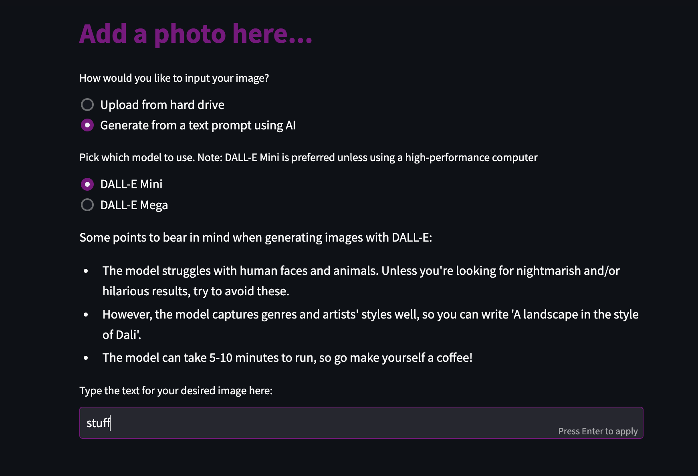
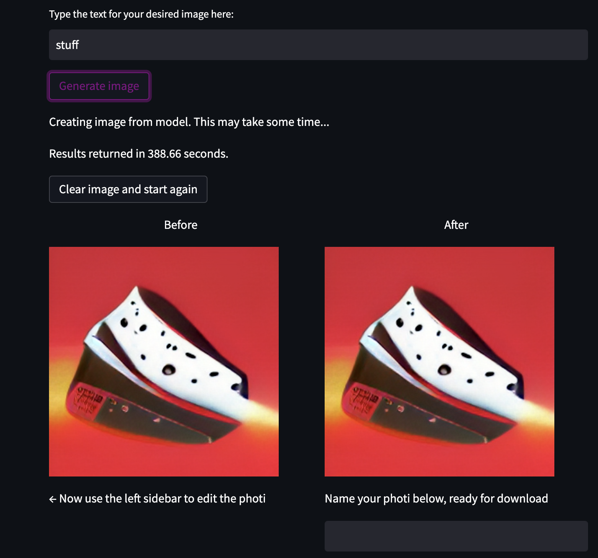
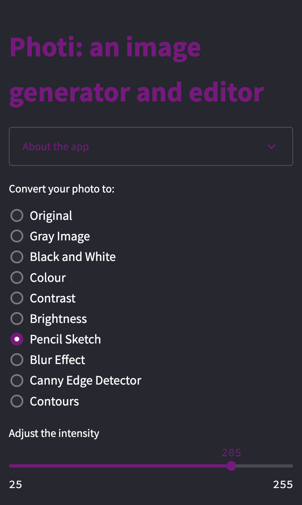
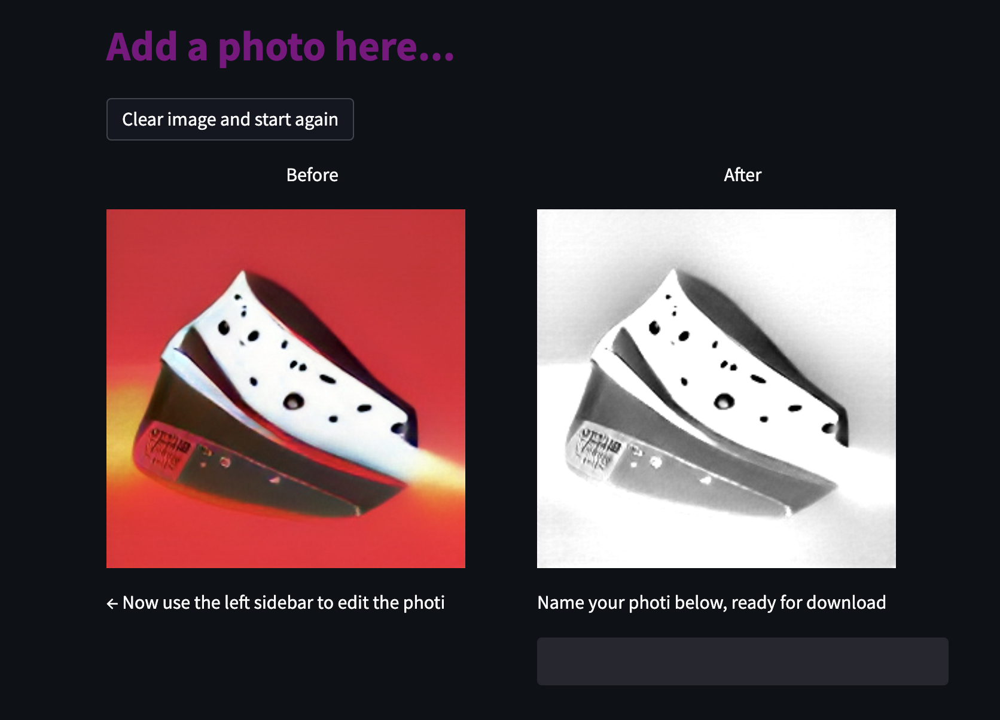
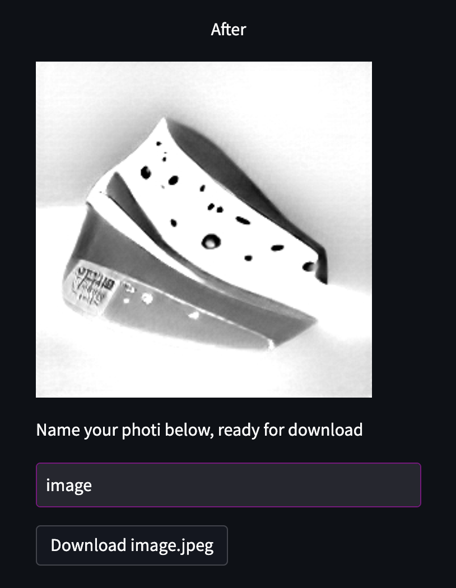

# Photi: a Streamlit app for generating and manipulate images

*A YouTube tutorial can be found [here](https://youtu.be/ftnPuG2fWao)*

Photi is an image editing app built in Python using the Streamlit framework. You can either upload images or generate them yourself using text prompts, via a lightweight implementation of the DALL·E deep learning text-to-image model. Once you've provided the picture, you can perform a variety of image editing and machine learning tasks.

Photi was built in 2022 by Sam Lupton for the Harvard CS50 course.

## Getting Started
Clone this repo and run the following in your command line (assuming you have Python downloaded):
```
pip install -r requirements.txt
python setup.py
streamlit run app.py
```
`pip install -r requirements.txt` will download the required packages.

`python setup.py` will run the setup script and download the DALL·E model. Note that `setup.py` takes the optional command-line arguments `mini` or `mega`, defaulting to `mini` if none are provided. Running with `mega` and selecting `DALL·E Mega` in the app will download and use a large (5GB) version of the model. Use at your own discretion, because it will be loaded into memory and may cause issues on less performant computers.

Finally, `streamlit run app.py` will kick off the Streamlit server and get the app running. To use it, either follow the link that should appear on your terminal or open your browser and navigate to `http://localhost:8501`.

## Uploading your Photi

From the homepage, you can click *Browse files* to upload your own image, or *Generate from a text prompt using AI*.

<figure>
  
  <figcaption>Fig. 1 - The Photi homepage</figcaption>
</figure>

If generating an image with text input, you'll get a choice of models to use. For performance reasons mentioned above, it's recommended you stick with the default `DALL·E Mini`. If you don't, you'll need to have downloaded `DALL·E Mega` by running `python setup.py mega`.

<figure>
  
  <figcaption>Fig. 2 - DALL·E text input</figcaption>
</figure>

Remember, DALL·E has its limitations, so read the small print here! In addition, please be aware that, according to [the model's authors](https://huggingface.co/dalle-mini/dalle-mini):
> The model was trained on unfiltered data from the Internet

This means it is vulnerable to all the same bias and content issues as the internet itself.

Anyway, once you've either:
- uploaded a photo
- typed your text input, pressed enter and clicked `Generate image`, and waited 5-10 minutes

You'll see a before and after version appear onscreen.

<figure>
  
  <figcaption>Fig. 3 - DALL·E generated image</figcaption>
</figure>

The time has now come to edit your Photi. In the left sidebar, you can pick an effect to apply on your image. As well as standard image editing features like adjusting contrast and brightness, you get 4 computer vision features: pencil sketch, blur effect, edge detection with the Canny algorithm, and contours (which will add contours to your image in green).

<figure>
  
  <figcaption>Fig. 4 - Edit your Photi</figcaption>
</figure>

Adjust the sliders to change the effect's intensity, and your changes will show up on the right as you go.

<figure>
  
  <figcaption>Fig. 5 - An edited Photi</figcaption>
</figure>

Once you're finished with your image, give it a name in the text box below, hit enter and download.

<figure>
  
  <figcaption>Fig. 6 - Add a name, press enter and download your Photi</figcaption>
</figure>

Bingo! You're all done.

## Acknowledgements

This project is an extension of several different projects, so credit must go to:
- Boris Dayma and the DALL·E Mini authors for open sourcing and fully licensing their model [here](https://github.com/borisdayma/dalle-mini) (you can try it out with [this](https://github.com/borisdayma/dalle-mini/blob/main/tools/inference/inference_pipeline.ipynb) notebook)
- Rafael Messias Grecco for [Build a Simple Photo Editor](https://medium.com/analytics-vidhya/meet-streamlit-sharing-build-a-simple-photo-editor-9d9e2e8872a)
- Sharone Li for [Create a Photo Converter App](https://towardsdatascience.com/create-a-photo-converter-app-using-streamlit-surprisingly-easy-and-fun-db291b5010c6)